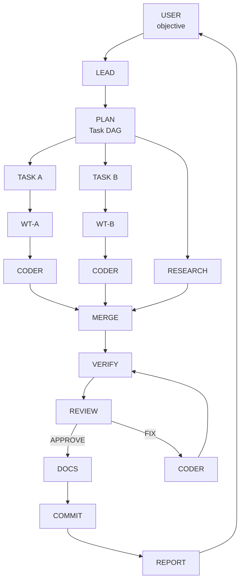

# Canonical Engineering Workflow

This document defines the target workflow the harness should follow as closely as the underlying OpenCode capabilities allow. The purpose is to make orchestration deterministic through explicit stages, isolation, verification, and review gates rather than relying on increasingly elaborate prompts.

## Workflow diagram

The canonical flow is:

```text
                    ┌──────────────┐
                    │    USER      │
                    │ objective    │
                    └──────┬───────┘
                           │
                           ▼
                    ┌──────────────┐
                    │     LEAD     │
                    └──────┬───────┘
                           │
                    ┌──────▼───────┐
                    │    PLAN      │
                    │   Task DAG   │
                    └──────┬───────┘
                           │
               ┌───────────┼───────────┐
               ▼           ▼           ▼
            TASK A      TASK B      RESEARCH
               │           │
             WT-A        WT-B
               │           │
               ▼           ▼
             CODER       CODER
               │           │
               └─────┬─────┘
                     ▼
                   MERGE
                     │
                     ▼
                 VERIFY
                     │
                     ▼
                 REVIEW
                  /    \
             APPROVE   FIX
                │        │
                │        └──► CODER
                ▼
              DOCS
                │
                ▼
             COMMIT
                │
                ▼
              REPORT
                │
                ▼
               USER
```

## Mermaid representation



## Stage semantics

| Stage | Responsibility | Required invariant |
|---|---|---|
| **USER** | Defines objective and consequential decisions | User owns what and why; the harness owns how. |
| **LEAD** | Coordinates the engineering loop | Lead orchestrates and delegates; it should not perform normal feature implementation. |
| **PLAN** | Produces the implementation plan and task dependency graph | Planning does not modify source code. |
| **TASK / WORKTREE** | Isolates independent implementation work | One independent task maps to one worktree and one implementation agent. |
| **RESEARCH** | Resolves external unknowns | Research informs planning/implementation rather than silently changing scope. |
| **CODER** | Implements bounded tasks and tests | Production implementation happens through the coder role. |
| **MERGE** | Integrates completed isolated work | Conflicts are surfaced and explicitly resolved; incomplete work is not silently discarded. |
| **VERIFY** | Runs tests, lint, type checks, and other relevant validation | Failed verification cannot transition to completion. |
| **REVIEW** | Independently evaluates the resulting artifact | Reviewer evaluates the objective, constraints, diff, and surrounding code—not merely the coder's explanation. |
| **FIX** | Resolves review findings | `NEEDS FIXES` must return to coder → verify → review; it cannot bypass review into commit. |
| **DOCS** | Records required documentation changes | Documentation occurs only after the artifact has passed review. |
| **COMMIT** | Creates routine commits | Commit does not imply permission to push or publish. |
| **REPORT** | Summarizes the completed work | Report must distinguish done, verified, decisions, delegation, and items requiring the user. |

## State-transition invariants

The harness should progressively enforce these as mechanical state/capability constraints rather than prompt-only instructions:

1. `USER → LEAD → PLAN` precedes implementation.
2. `PLAN` produces dependencies so independent tasks can run concurrently while dependent tasks wait.
3. Independent implementation tasks use isolated worktrees.
4. Normal feature implementation is delegated to `CODER`.
5. `MERGE` precedes final verification of the integrated result.
6. `VERIFY` must succeed before the work can be reported complete.
7. `REVIEW` is independent of the coder's self-assessment.
8. `REVIEW → NEEDS FIXES` can only transition through `CODER → VERIFY → REVIEW`.
9. `APPROVE → DOCS → COMMIT → REPORT` is the normal completion path.
10. `COMMIT` never implies `PUSH`; consequential external actions remain behind explicit approval gates.

## Why this is the target

The repository already implements many of these ideas: delegation-first execution, specialized agents, worktree isolation, verification, independent review, routine commits, and explicit approval boundaries. This diagram makes the desired orchestration model explicit so future implementation changes can be evaluated against a stable state machine.

The goal is **not** to add agents for their own sake. The goal is to make the existing roles and capabilities conform more reliably to a small number of explicit states, transitions, and invariants.
